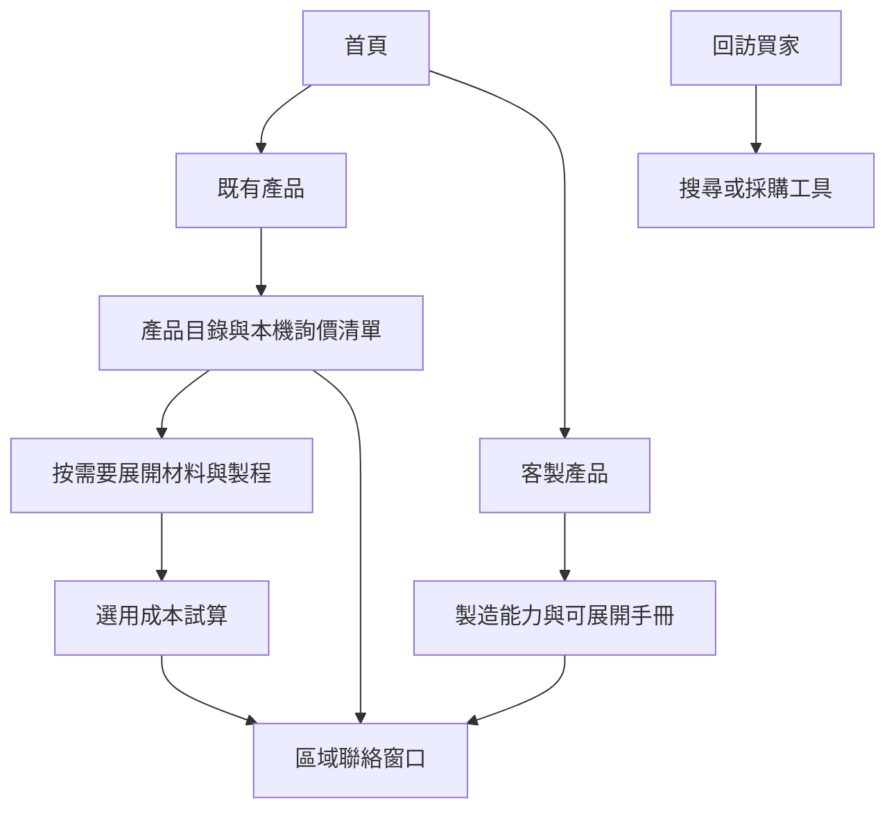

# Birdland 買家導向架構與施工紀錄

最新施工狀態（2026-10-02）：三個平行入口、共用產品／市場條件、精簡消息與市場比較，請以 [BUYER-INTELLIGENCE-REDESIGN.md](BUYER-INTELLIGENCE-REDESIGN.md) 為準。市場統計明示 2024 對 2023 年；即時運費及商業條件不預填。

採購工具最新施工結果（2026-10-02）：主操作已合併為成本、補貨、趨勢三個任務。舊採購網址遷移至新入口，工程深連結保留。請以 [BUYING-TOOLS-REDESIGN.md](BUYING-TOOLS-REDESIGN.md) 的流程、公式、相容邊界及驗證紀錄為準。

最新型錄整合（2026-10-02）：Products 已改用獨立模板，展示 69 個經核對的正式型號與照片。金屬製造定位、舊選款相容、世界銀行月資料及詢價／試算邊界，請以 [CATALOGUE-INTEGRATION.md](CATALOGUE-INTEGRATION.md) 為準。

最新 Products 與 Buying tools 視覺精簡，請見 [PRODUCTS-TOOLS-REVIEW.md](PRODUCTS-TOOLS-REVIEW.md)。

## 目標

保留 Birdland 的玉綠、米白、銅色、襯線字體、產品圖片及線稿。讓買家先找到產品或製造能力，按需要進入材料、製程與成本工具，最後聯絡區域窗口。維持靜態 GitHub Pages，不增加資料庫、會員、後台、通知訂閱或客服流程。

## 頁面架構

| 公開入口 | 買家任務 | 既有網址 |
|---|---|---|
| 產品 | 找產品、保留詢價清單、選材料與製程 | `partner.html#bl-cat` |
| 製造 | 了解能力，再展開技術手冊 | `product-101.html` |
| 採購工具 | 自選成本、供應資訊或市場比較工具 | `buying-tools.html` |
| 關於 | 了解公司與 OEM 商業邊界 | `about.html` |
| 聯絡 | 聯絡既有區域窗口 | `contact.html` |

搜尋與語言選擇在共用導覽。Guide 保留直接連結與完整舊說明，但首頁先提供既有產品與客製產品兩條路徑。ABrief、My Market、CostNow 留在採購工具；Team 保留直接網址，從公開導覽與搜尋移除。



## 程式與資料分層

| 層 | 單一維護來源 | 邊界 |
|---|---|---|
| 網址與導覽 | `config/routes.json` | 公開入口、工具用途、內部頁標示 |
| 語言清單及新增介面文字 | `config/languages.json` | 十語言；既有長文翻譯維持 `i18n/` |
| 產生頁面對照 | `config/build.json` | 模板、輸出、buyer/cost、目錄開關 |
| 共用頁面建置 | `tools/build/site.js` | JSON 安全嵌入、替換標記、共用資產 |
| 導覽與閱讀層次 | `buyer-navigation.js`、`buyer-journey.css` | 保留原資料與工具事件；詳細內容可展開 |
| 可供瀏覽器使用的設定 | `site-registry.js` | 由上述設定產生，不手改 |
| 商業 SKU | `catalog.json` | SKU、品項分類、市場要求、成本指數；不新增報價資料 |
| 工程選項 | `data/manufacturing-options.json` | family key → model → part → material pairs / process pairs；原值完整移植 |
| 工具畫面 | `tools/partner_template.html` | 共用骨架；既有 buyer/cost URL 與 mode 邊界 |
| 工具樣式 | `desk/*.css` | foundation、light-theme、buyer-layout、workspace 與搜尋樣式 |
| 工具行為 | `desk/*.js` | 計算、路由、資料渲染、產品組裝、聯絡交接等分檔 |
| 跨頁選擇 | `context.js` | `bl_ctx` 和舊 localStorage keys 相容；無效型別回復預設 |
| 動態市場資料 | `outlook-data.json`、`trade.json` | 維持既有更新器、來源資訊與 AI 欄位 allowlist |

工程選項與 catalog SKU 是不同資料：前者是製造選項參考，後者是具體產品目錄。本次未杜撰兩者之間的 SKU 對應。若將來建立對應，應新增明確 `catalog product id → family/model key`，先驗證再提供介面。也未把市場 proxy 指數當成實際工廠報價。

工具腳本依原先執行位置同步載入；不隨意加 `defer` 或改初始化順序。`desk/panel-router.js`、`desk/bento-grid.js`、`desk/product-builder.js` 的前後關係維持。材料與製程名稱完整保留，119 種既有材料名稱未新增或更名。

## 已完成施工階段

| 階段 | 內容 | 驗收 |
|---|---|---|
| 1 盤點與隔離 | 公開 clone、乾淨 main 基準、獨立 `refactor/buyer-journey` 分支 | 未使用或複製登入憑證；未碰 Outlook |
| 2 統一建置 | 本機、Python 相容入口、每日 CI 與 PR 驗證使用同一 Node builder | 消除 `__CATALOG__` 未替換問題；精確比較產出 |
| 3 整理資訊架構 | 五個入口、兩條首頁路徑、工具入口、詳細內容收合 | 網址、hash、十語言保留；移除公開 Team 入口 |
| 4 程式分層 | 六份工具樣式、24 份功能腳本、工程選項 JSON、共用設定 | 原初始化順序、計算邏輯與選擇狀態保留 |
| 5 相容與交付 | 行為測試、完整預覽打包、更新文件與 CI | 375/1280px、12 公開頁、十語言、搜尋、清單保存與成本計算 |

## 建置與驗證

Node 24，鎖定依賴使用 `npm ci`。本機瀏覽器測試使用已安裝 Chrome；其他機器可指定 `CHROME_PATH`。

```powershell
npm ci --no-audit --no-fund
npm run build
npm run check
npm test
npm run preview
npm run preview:package
```

`npm run build` 產生六個模板頁、設定與搜尋索引。Factory、Configurator 仍由專用生成器處理：`node tools/dev/build-p101.js`、`node tools/dev/build-configurator.js`。修改 facade 文字後用 `node tools/dev/i18n-build.js`；修改 Factory/Configurator 內容後依既有 `i18n-page.js` 流程翻譯，再驗證 `i18n-drift.js`。不要只打 fingerprint 來掩蓋未完成翻譯。

每日仍以 `python tools/build_news.py` 進入，該檔呼叫相同 Node builder，接續既有 RSS 建置。AI 與行情抓取仍採原容錯設計；建置或資料合約失敗會停止自動提交。自動更新改用明確檔案清單，避免帶入其他檔案。

預覽打包包含 CSS、JavaScript、產品圖片、語言資料、各語言頁、feeds、calendars、推廣頁與工具共用檔案，不包含依賴、憑證或工具源碼。打包保留 Team 頁是網址相容；它的瀏覽器 PIN 並非真正的存取控制。

## 無資料庫的回訪價值

恢復既有產品目錄與本機詢價清單，保留同瀏覽器內的市場、材料與成本選擇；降低回訪買家重新尋找與輸入的時間。這些狀態只在目前瀏覽器，不承諾跨裝置同步。市場資料的日期與來源維持顯示。未新增任何需要營運人員每日維護的會員、消息通知、個人化推薦或自動報價服務。

## 發布與回復

本次只在本機施工。儲存庫由 main 直接發布，push 就可能上線；需使用者明確下達 push/發布指令才執行。發布前以 PR 完整預覽、現有每日資料樣本及相容檢查結果檢視。回復時應整組回復模板、共用資產、設定與生成頁，並再提升 service worker 版本，避免快取混用。

## 後續工程界線

本次完成導覽、資料來源、建置與工具檔案分層；既有計算公式和 DOM renderer 保留在對應模組，未重新設計公式。之後若要進一步抽成純函式，應逐個計算器增加原頁對照測試後再替換。既有來源資料品質、實際帳戶 API 取得與 GitHub 上的執行結果，仍需發布後觀察；本機自測不代表外部 API 保證可用。
